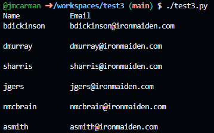

# Test 3
## Permitted aids and time
You are allowed to use a one page reference sheet. This test is to be completed in class.

## Instructions

- Open the provided templates **test3.py** & **lib.py** Note the comment block at the top is the only thing that has been provided in these template.

- Modify the comment block to include:
    - Author: Your name; your email
    - Date: Today's date

### lib.py
- Define a function called **write_csv** that accepts 3 arguments:
    - **namesFile**
    - **emailsFile**
    - **usersFile**

- Define a function called **read_csv** that accepts 1 argument:
    - **file**

#### write_csv
- The function will:
    - Read the provided .dat files
    - Check if the .dat files exist. If they don't, exit indicating an error.
    - Check if the .csv **file** exists. If it doesn't create it. If it does, open it with append access.
    - Combine each line in the files (user and email) in CSV format (separated by a comma), and write it to .csv **file**
    - Close each file

#### read_csv
- The function will:
    - Open the csv file **users.csv**
    - Read each line and print it out separated by a tab with a fixed field size using the following print statement:
        - print(f"{data[0]:10}\t{data[1]}")

### test2.py
- Import the write_csv and read_csv functions from your library (lib)
- Import sys modules
- Call each function in this sequence:
    - write_csv
        - Passing it the arguments:
            - **names.dat** A list of usernames
            - **emails.dat** A list of email addresses
            - **users.csv**: The destination file to be written

    - read_csv
        - Passing it the argument:
            - **users.csv**: The destination file to be read, formatted and displayed

Your program should display the following sample output:

## Submission
To submit your test you need to submit the code to your GitHub repo (which you already did). You can submit as many times as you wish within our allocated class time. Additionally, you need to submit a screenshot of it running (showing the expected output) to the Test 1 assignment folder in eCentennial.
